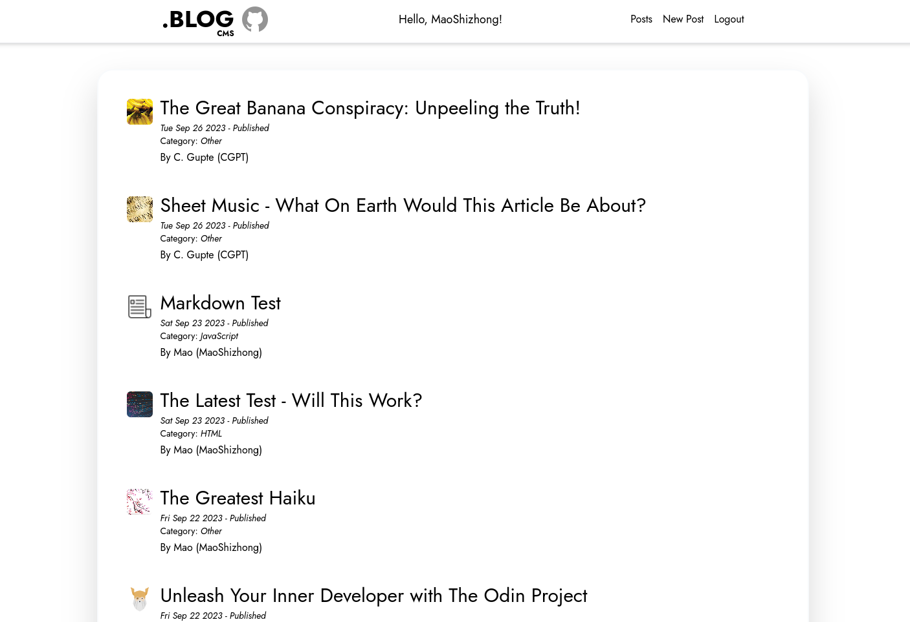
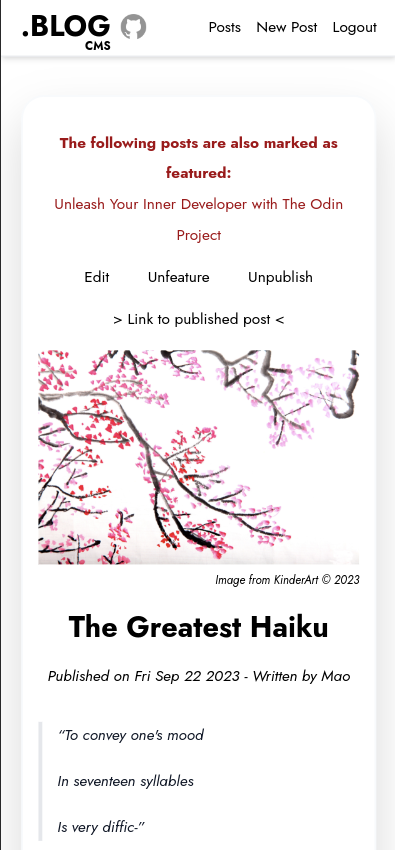

# dotBlog CMS

## Repos

API: [Repo](https://github.com/MaoShizhong/blog-API)

Main client: [Repo](https://github.com/MaoShizhong/dotBLOG) | [Live](https://dotblog.netlify.app/)

## API Built using

-   React w/ TypeScript
-   Vite
-   [he](https://www.npmjs.com/package/he)
-   [React Markdown](https://github.com/remarkjs/react-markdown)
-   [react-syntax-highlighter](https://www.npmjs.com/package/react-syntax-highlighter)
-   Deployed via Netlify

 
